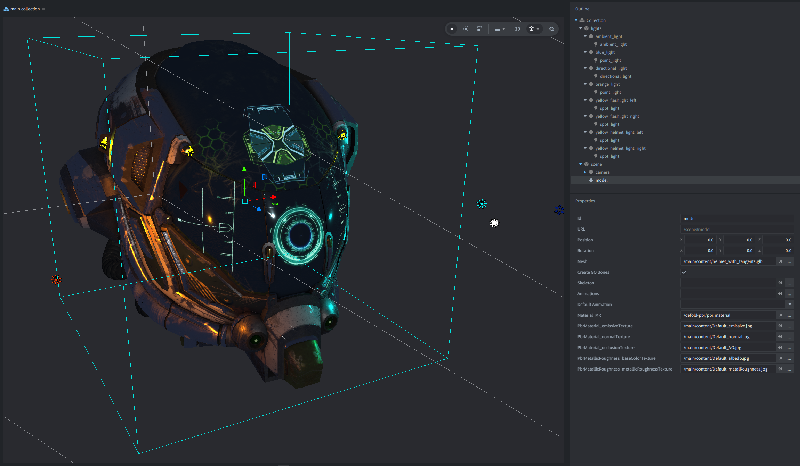

# defold-pbr

Reusable PBR shader library for Defold projects.

This asset provides a base metallic-roughness PBR material and shader stack that
can be used directly, or included by another extension that adds features such
as image based lighting.

## Included Files

Base PBR material and programs:

- `/defold-pbr/pbr.material`
- `/defold-pbr/shaders/pbr.vp`
- `/defold-pbr/shaders/pbr.fp`
- `/defold-pbr/shaders/pbr_lighting.glsl` (light accumulation and final composition)

The shader uses Defold model PBR constants from the `PbrMaterial` uniform block
and binds glTF textures by the sampler names populated by the model component.
It supports metallic-roughness base color data, normal/occlusion/emissive
textures, alpha cutoff/unlit flags, IOR, smooth transmission, volume attenuation,
and directional/point/spot lights from Defold's light component buffer.



Image based lighting is left to extension projects. Extension projects can
include these shaders and inject extra lighting into `PBRLightData` before final
composition. The supplied `pbr.material` supports all of these features;
projects configure material tags to select their render passes.

## Installing In A Project

Add this asset as a dependency in `game.project`:

```ini
[project]
dependencies#0 = https://github.com/defold/asset-pbr/archive/refs/heads/master.zip
```

If your project already has dependencies, use the next available dependency
index instead of `dependencies#0`.

Fetch libraries from the Defold editor with `Project > Fetch Libraries`. After
fetching, the asset is available under `/defold-pbr`.

## Using The Material

Assign `/defold-pbr/pbr.material` to any model that should use the base PBR
shader.

For imported glTF/glB content, keep the sampler names generated by Defold's
model pipeline:

```glsl
PbrMetallicRoughness_baseColorTexture
PbrMetallicRoughness_metallicRoughnessTexture
PbrMaterial_normalTexture
PbrMaterial_occlusionTexture
PbrMaterial_emissiveTexture
PbrTransmission_transmissionTexture
PbrVolume_thicknessTexture
```

The material expects the standard Defold PBR material constants:

```glsl
PbrMaterial
PbrMetallicRoughness
PbrTransmission
PbrVolume
PbrIor
```

These are normally populated by the model component when using imported glTF
material data.

## Lighting

Use Defold's built-in light components for punctual lighting:

- directional light
- point light
- spot light

The shaders include `/builtins/materials/lighting.glsl`, so light data comes
from Defold's `LightBuffer` instead of a custom uniform array. Ambient light is
read from the built-in `light_info.xyz` value.

The base shader handles the same light loop shape as Defold's built-in
`lighting.glsl`: it reads `light_info.w` for the active light count and loops
over `MAX_LIGHT_COUNT`.

## Render Script Requirements

Use a render script that draws models with a camera view/projection and allows
Defold to provide the light buffer to materials. A typical model draw path is
enough:

```lua
render.set_view(camera.view)
render.set_projection(camera.proj)
render.enable_state(graphics.STATE_DEPTH_TEST)
render.enable_state(graphics.STATE_CULL_FACE)
render.draw(self.model_predicate, camera.frustum)
```

No custom PBR light constants are required by this asset. Opaque models with
zero transmission do not sample transmission textures or scene color, so they
can use this ordinary draw path without a scene capture. Transmissive models
require the additional render passes described below.

## Extending The Shader

The base fragment shader is structured around `PBRLightData`:

```glsl
PBRParams params = get_pbr_params();
MaterialInfo material = get_material_info(params);

PBRLightData pbr_data = calculate_pbr_light_data(params, material, var_position.xyz);
pbr_data.specular += calculate_custom_specular(params, material);

vec3 color = composite_pbr_transmission(params, material, pbr_data, 1.0);
```

Useful extension points:

- `PBRParams` contains material flags, texture presence, view-space normal/view,
  and matching world-space position/normal/view vectors.
- `MaterialInfo` contains resolved base color, diffuse color, metallic,
  roughness, and specular values.
- `PBRLightData` separates diffuse, specular, emissive, occlusion, and alpha so
  extension shaders can add image based lighting or other terms before
  compositing.

An extension fragment shader can include `pbr_lighting.glsl` and add its own
lighting before calling `composite_pbr_transmission()`. This include provides
light accumulation, transmission, and volume attenuation:

```glsl
in mediump mat4 var_view;
#define MAX_LIGHT_COUNT 8
#include "/defold-pbr/shaders/pbr_lighting.glsl"

void main()
{
    PBRParams params = get_pbr_params();
    MaterialInfo material = get_material_info(params);

    PBRLightData data = calculate_pbr_light_data(params, material, var_position.xyz);
    add_pbr_light_data(data, calculate_extra_light_data(params, material));

    vec3 color = composite_pbr_transmission(params, material, data, 1.0);
    out_fragColor = vec4(to_output(color), data.alpha);
}
```

## Transmission and Volume Attenuation

`/defold-pbr/pbr.material` already includes the shader and bindings needed for
transmission. Configure the material tags in your project to draw transmissive
geometry after the opaque scene is captured. For the render script below:

1. Keep opaque geometry, including the backdrop, on `/defold-pbr/pbr.material`,
   which uses the `model` tag.
2. Copy that material into your project, for example `/materials/glass.material`,
   and replace its `model` tag with `model_transmission`. Keep `pbr.vp`, `pbr.fp`,
   constants, and samplers unchanged.
3. Assign the project material to transmissive glTF materials. Do not retain the
   `model` tag on it, since that would also include glass in the opaque capture.

The project material selects a render pass; transmission itself is driven by
the imported glTF data. The backdrop is ordinary collection content; no
particular grid or model is built into the shader or renderer.

The shader reads the imported `KHR_materials_transmission`, `KHR_materials_volume`,
and `KHR_materials_ior` values. It supports base-color tint, IOR, thickness factor,
thickness texture (green channel), transmission texture (red channel), node and
game-object scale, and attenuation color/distance. The two texture samplers are:

```glsl
PbrTransmission_transmissionTexture
PbrVolume_thicknessTexture
```

These textures contain linear data. Keep the imported sampler bindings and use
white fallback textures when absent. Defold must supply the corresponding glTF
constants and texture bindings; generated thickness bindings require the importer
support in [defold/defold#13303](https://github.com/defold/defold/pull/13303), on
the [`codex/gltf-attenuation`](https://github.com/defold/defold/tree/codex/gltf-attenuation)
branch. IOR is also applied to non-transmissive dielectric materials; it does
not require a transmission feature define.

### Render Passes

The material needs an opaque scene texture named `tex_scene_color`. Create a
window-sized render target with an RGBA color attachment (linear filtering and
clamp-to-edge wrapping) and a depth attachment. Resize it with the window and
delete it in the render script's `final()` function. Using the same camera and
viewport throughout, draw the world as follows:

```lua
-- The main target has already been cleared.
render.set_depth_mask(true)
render.enable_state(graphics.STATE_DEPTH_TEST)
render.enable_state(graphics.STATE_CULL_FACE)
render.disable_state(graphics.STATE_BLEND)

render.set_render_target(self.scene_target)
render.clear({
    [graphics.BUFFER_TYPE_COLOR0_BIT] = self.clear_color,
    [graphics.BUFFER_TYPE_DEPTH_BIT] = 1,
})
render.draw(self.model_predicate, draw_options)
render.set_render_target(render.RENDER_TARGET_DEFAULT)

-- Draw again to populate the main target's color and depth.
render.draw(self.model_predicate, draw_options)
render.enable_texture("tex_scene_color", self.scene_target, graphics.BUFFER_TYPE_COLOR0_BIT)
render.draw(self.transmission_predicate, draw_options)
render.disable_texture("tex_scene_color")
```

Use `render.predicate({"model_transmission"})` for `transmission_predicate`.
Include any additional opaque background predicates in both opaque passes, and
exclude transmissive materials from the capture to avoid feedback.
Draw GUI and other overlays afterward, restoring their render state as usual.

The captured scene must use the base shaders' `to_output()` conversion. It is
converted back to linear before attenuation. A custom HDR or tone-mapped pipeline
must adapt this conversion.

### Adding IBL

This asset provides transmission with Defold lights; it does not provide an IBL
environment. An IBL extension such as `defold-pbr` can include `pbr_lighting.glsl`
without copying the base shaders. Compose after adding IBL so that transmission
also applies to the accumulated indirect lighting:

```glsl
in mediump mat4 var_view;
#define MAX_LIGHT_COUNT 8
#include "/defold-pbr/shaders/pbr_lighting.glsl"
// Include the extension's IBL helpers here.

// Inside main():
PBRParams params = get_pbr_params();
MaterialInfo material = get_material_info(params);
PBRLightData light = calculate_pbr_light_data(params, material, var_position.xyz);
add_pbr_light_data(light, calculate_ibl_light_data(params, material));
vec3 color = composite_pbr_transmission(params, material, light, exposure);
out_fragColor = vec4(to_output(color), 1.0);
```

Use the same extension fragment shader for opaque and transmissive materials.
Configure the project materials with the respective `model`/`model_transmission`
tags. Retain the `mtx_world`/`mtx_projection` fragment constants and transmission
samplers from `pbr.material`, then add the IBL samplers. Keep those environment
textures bound for both opaque and glass draws. Exposure applies to local
lighting only; the captured background has already been exposed. Existing IBL
materials must call `composite_pbr_transmission()` after adding IBL; updating
the dependency alone does not change their composition call.

### Limits

This is a screen-space approximation for smooth glass, such as glTF
AttenuationTest. Rough transmission blur, transmission through other glass,
off-screen scene sampling, and caustics are not implemented. Matching a reference
image also requires matching its camera, environment, and exposure.
